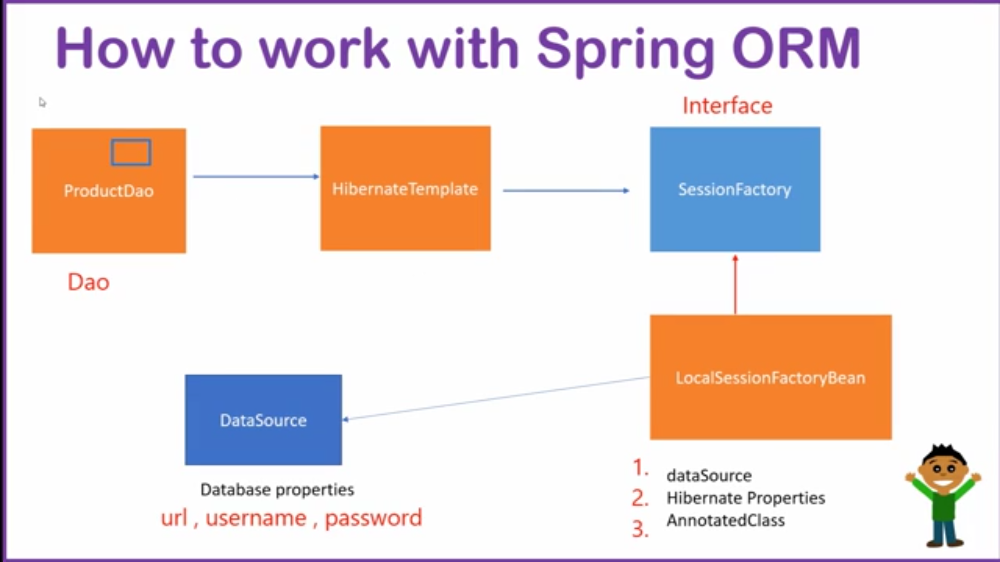

# Spring ORM CRUD App

This documentation is based on the YouTube tutorial:

🎥 **Title:** Completing My Database Application using Spring ORM
📺 **Channel:** [Learn with Durgesh](https://www.youtube.com/@LearnCodeWithDurgesh)

---

## 📘 Topics Covered

This project demonstrates the following:

1. **Introduction to Spring ORM**

   * ORM Tools: `Hibernate`, `TopLink`, `iBATIS`
   * Spring provides abstraction using `HibernateTemplate`

🖼️ Architecture Diagram

How its works:




2. **How Spring ORM Works**

   * Configuration:

     * DataSource: `BasicDataSource`
     * ORM: `Hibernate`, `HibernateTemplate`
     * Transaction Management: `@Transactional`
   * Core Concepts: DAO Layer, Entity Mapping

3. **Spring ORM Setup**

   * Java-based Configuration (No XML)
   * Annotated classes: `@Configuration`, `@ComponentScan`, `@Bean`

4. **Database Setup:**

   ```sql
   CREATE DATABASE springormdb;

   CREATE TABLE users (
       id INT PRIMARY KEY AUTO_INCREMENT,
       name VARCHAR(50),
       city VARCHAR(50)
   );
   ```

5. **Hibernate Configuration Example:**

   ```java
   @Bean
   public LocalSessionFactoryBean sessionFactory() {
       LocalSessionFactoryBean factory = new LocalSessionFactoryBean();
       factory.setDataSource(getDataSource());
       factory.setPackagesToScan("com.springorm.demo");
       Properties props = new Properties();
       props.setProperty("hibernate.dialect", "org.hibernate.dialect.MySQL8Dialect");
       props.setProperty("hibernate.hbm2ddl.auto", "update");
       props.setProperty("hibernate.show_sql", "true");
       factory.setHibernateProperties(props);
       return factory;
   }
   ```

6. **Performing CRUD Operations:**

   ```java
   // Insert
   dao.saveUser(new User("Durgesh", "Delhi"));

   // Read
   List<User> list = dao.getAllUsers();

   // Update
   User user = dao.getUser(1);
   user.setName("Durgesh Kumar");
   dao.updateUser(user);

   // Delete
   dao.deleteUser(user);
   ```

7. **User Interface (Console-Based):**

   * User selects options: Add, View, Update, Delete
   * Actions performed live on MySQL database

---

## 🛠️ Technologies and Tools Used

* **Java 17+**
* **Spring ORM (Spring Framework)**
* **Hibernate 5**
* **MySQL Database**
* **Apache Commons DBCP** – connection pooling
* **Annotation-based Spring Config**
* **NetBeans / IntelliJ / Eclipse** – recommended IDEs
* **MySQLYog / phpMyAdmin** – DB UI tools

---

## 📂 Maven Dependencies

```xml
<dependencies>
  <dependency>
    <groupId>org.springframework</groupId>
    <artifactId>spring-context</artifactId>
    <version>5.3.30</version>
  </dependency>
  <dependency>
    <groupId>org.springframework</groupId>
    <artifactId>spring-orm</artifactId>
    <version>5.3.30</version>
  </dependency>
  <dependency>
    <groupId>org.hibernate</groupId>
    <artifactId>hibernate-core</artifactId>
    <version>5.6.15.Final</version>
  </dependency>
  <dependency>
    <groupId>mysql</groupId>
    <artifactId>mysql-connector-java</artifactId>
    <version>8.0.33</version>
  </dependency>
  <dependency>
    <groupId>org.apache.commons</groupId>
    <artifactId>commons-dbcp2</artifactId>
    <version>2.9.0</version>
  </dependency>
</dependencies>
```

---

## 🧠 Summary

* Easy-to-understand, one-file Spring ORM implementation
* Covers real-world CRUD operations
* Built with Java-based configuration (no XML)
* Console-based interaction makes it beginner-friendly
* Ideal for revision or practice after watching Durgesh’s tutorial

Use this as a **learning template** or **kickstart for real apps**!

---

Happy Learning! 🎯
